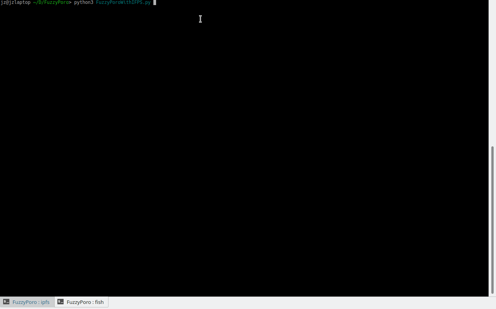

Metrics Prototype
===============

Python prototype of biometric private key recovery system (for blockchain and other decentralized protocols).

Design Spec and Motivation
===============
https://www.notion.so/Design-Spec-fa2b4e36d1b74d56bfca7a5062aa5faf

Usage
=====
1.Install dependences:
  
    $ pip3.7 install fuzzy-extractor
  
    $ pip3.7 install TripleSec
  
    $ pip3.7 install ipfsapi
 
2.Clone the repo and run FuzzyPoroWithIPFS with Python3

3.Follow the instructions ;)

Credit
=====
Currently using https://github.com/carter-yagemann/python-fuzzy-extractor and https://github.com/keybase/python-triplesec

